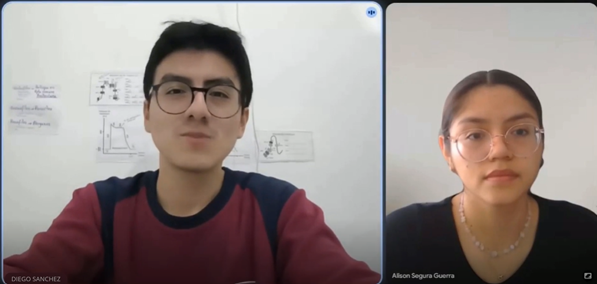

## 2.2. Entrevistas

#### 2.2.1. Diseño de Entrevistas

Las entrevistas constituyen la principal técnica de investigación cualitativa para la validación del problema y la propuesta de valor de Tourmate. El objetivo es comprender en profundidad las necesidades, frustraciones, comportamientos actuales y expectativas de los dos segmentos de usuario identificados: los **dueños o responsables de agencias de turismo de aventura** y los **turistas de aventura**.

---

##### Objetivos Generales del Proceso de Entrevistas

1. Validar la existencia y criticidad del problema de monitoreo y seguridad en tours de aventura en zonas remotas del Perú.
2. Comprender cómo gestionan actualmente sus operaciones las agencias de turismo de aventura, identificando herramientas utilizadas, brechas y puntos de dolor.
3. Explorar la disposición de las agencias a adoptar una solución tecnológica integrada y su sensibilidad al precio.
4. Entender la experiencia del turista durante el tour: qué información desearía tener, qué situaciones de riesgo ha vivido y qué herramientas digitales ya usa.
5. Identificar funcionalidades prioritarias y posibles fricciones en la adopción del producto desde la perspectiva de ambos segmentos.

---

##### Segmento 1: Dueños o Responsables de Agencias de Turismo de Aventura

**Perfil del entrevistado:** propietarios, directores de operaciones o guías principales de agencias que operen rutas de trekking, montañismo, expediciones o turismo de naturaleza en zonas remotas del Perú. Preferiblemente agencias medianas o pequeñas con operaciones activas en sierra, selva alta o circuitos andinos.

---

**Preguntas de apertura y contexto**

1. ¿Podría contarme brevemente cómo funciona su agencia? ¿Qué tipo de tours opera y en qué zonas del país?
2. ¿Cuántos guías y turistas maneja típicamente en una temporada alta? ¿Cuántos grupos simultáneos puede llegar a tener activos?

**Preguntas sobre gestión operativa actual**

3. ¿Cómo realiza actualmente el seguimiento de sus grupos de turistas cuando están en campo? ¿Qué herramientas o medios utiliza (radio, celular, reportes manuales, apps)?
4. ¿Con qué frecuencia sus guías o grupos se quedan sin señal durante el recorrido? ¿Cómo manejan esa situación actualmente?
5. ¿Cómo coordina internamente a su equipo (guías, base de operaciones, contactos de emergencia) durante el desarrollo de un tour?
6. ¿Lleva algún registro de los recorridos realizados, incidentes ocurridos o datos de los turistas durante el tour? ¿De qué forma?

**Preguntas sobre seguridad y gestión de emergencias**

7. ¿Ha vivido alguna situación de emergencia o incidente grave durante algún tour? ¿Cómo fue la respuesta? ¿Qué falló o qué hubiera necesitado tener disponible en ese momento?
8. ¿Cómo determina si un turista está en una condición de riesgo (fatiga extrema, mal de altura, extravío) cuando no está físicamente con el guía?
9. ¿Qué protocolos de seguridad tiene establecidos actualmente? ¿Los considera suficientes?
10. ¿Ha recibido alguna vez una queja, reclamo o acción legal relacionada con un incidente de seguridad? ¿Cómo afectó eso a su operación?

**Preguntas sobre tecnología y adopción**

11. ¿Utiliza actualmente alguna herramienta digital o software para gestionar sus operaciones (reservas, logística, comunicación con guías)? ¿Cuál es su experiencia con ella?
12. ¿Ha intentado implementar alguna solución tecnológica para el monitoreo en campo? ¿Qué resultó y qué no?
13. ¿Qué barreras considera que existen para que agencias como la suya adopten soluciones tecnológicas de monitoreo?

**Preguntas sobre disposición y expectativas**

14. Si existiera una plataforma que le permitiera ver en tiempo real la ubicación y estado de todos sus grupos activos desde un panel centralizado, ¿qué tan valiosa sería para usted? ¿Qué condiciones necesitaría para adoptarla?
15. ¿Estaría dispuesto a pagar una suscripción mensual por una solución así? ¿Qué rango de precio consideraría razonable?
16. ¿Qué funcionalidades consideraría indispensables y cuáles serían un plus? ¿Qué debería tener sí o sí desde el primer día?

---

##### Segmento 2: Turistas de Aventura

**Perfil del entrevistado:** personas que hayan realizado al menos una actividad de turismo de aventura en el Perú en los últimos dos años (trekking, montañismo, expedición en selva o ruta de naturaleza en zonas remotas), ya sean nacionales o extranjeros residentes en el país.

---

**Preguntas de apertura y contexto**

1. ¿Podría contarme sobre la última actividad de aventura que realizó en el Perú? ¿A dónde fue, qué ruta hizo y con quién?
2. ¿Con qué frecuencia realiza este tipo de actividades? ¿Suele contratar agencias o prefiere organizar sus propias expediciones?

**Preguntas sobre seguridad y experiencias previas**

3. Durante ese recorrido, ¿hubo momentos en los que se sintió inseguro o sin saber bien dónde estaba o cómo pedir ayuda? ¿Puede contarme ese momento?
4. ¿Alguna vez ha vivido o presenciado una emergencia o incidente durante un tour de aventura? ¿Cómo respondió la agencia o el guía?
5. ¿Siente que las agencias con las que ha viajado tienen mecanismos adecuados para garantizar su seguridad en caso de emergencia? ¿Por qué?
6. ¿Le preocupa la falta de conectividad o la dificultad para pedir ayuda cuando está en zonas remotas? ¿Cómo lo maneja actualmente?

**Preguntas sobre herramientas y tecnología usada**

7. ¿Qué aplicaciones o dispositivos utiliza durante sus actividades de aventura? (GPS, mapas offline, reloj deportivo, etc.) ¿Cuál es su experiencia con ellas?
8. ¿Comparte su ubicación con alguien (familiar, contacto de emergencia) durante el recorrido? ¿Cómo lo hace?
9. ¿Ha usado alguna aplicación que le permita ver su recorrido, registrar datos de salud (ritmo cardíaco, altitud) o documentar su experiencia durante el tour?

**Preguntas sobre expectativas e información durante el tour**

10. Durante un tour, ¿qué información le gustaría tener disponible en todo momento? (su posición en el mapa, distancia recorrida, signos vitales, clima, información sobre el lugar, etc.)
11. ¿Le resultaría útil poder ver en su teléfono información contextual del recorrido, como datos históricos del lugar, puntos de interés o alertas de riesgo específicas de la ruta?
12. ¿Cómo le gustaría registrar su experiencia durante el tour? ¿Fotos georreferenciadas, registros automáticos, notas de voz?

**Preguntas sobre confianza y adopción**

13. Si la agencia que contrató le ofreciera un dispositivo wearable que monitoree su ubicación y signos vitales durante el tour, ¿lo usaría? ¿Qué preguntas o dudas tendría al respecto?
14. ¿Tiene alguna preocupación sobre la privacidad de sus datos si una agencia monitorea su ubicación y salud en tiempo real?
15. ¿Cuánto influiría en su decisión de contratar una agencia el hecho de que esta cuente con tecnología de monitoreo en tiempo real y protocolos de emergencia avanzados?

---

##### Consideraciones Metodológicas

**Cantidad de entrevistas:** mínimo 3 y máximo 5 entrevistas por segmento (total: entre 6 y 10 entrevistas) para alcanzar saturación temática en una etapa de descubrimiento.

**Registro:** Las entrevistas deben ser grabadas con consentimiento del entrevistado para su posterior análisis. Se recomienda el uso de una guía de toma de notas que permita capturar citas textuales relevantes.

**Análisis:** Los resultados serán procesados mediante agrupamiento de respuestas por temática, identificando patrones comunes, necesidades no cubiertas y citas representativas para validar o refutar las hipótesis de problema y solución.

**Ética:** Antes de cada entrevista se informará al participante sobre el propósito de la investigación, la confidencialidad de sus respuestas y su derecho a retirarse en cualquier momento. No se recopilará información personal identificable más allá de la necesaria para el reclutamiento.

---

### 2.2.2. Registro de Entrevistas

##### Segmento 1: Dueños o responsables de agencia de turismo de aventura

**Entrevista 1:**

| Campo | Información | 
| :--- |:-------------------------------------------------------------------------------------------------------------------------------------------------------------------------------------------------------------------------------------------------------------------------------------------------------------------------------------------------------------------------------------------------------------------------------------------------------------------------------------------------------------------------------------------------------------------------------------------------------------------------------------------------------------------------|
| **Entrevistador:** | Molina Vásquez Manuel Alejandro                                                                                                                                                                                                                                                                                                                                                                                                                                                                                                                                                                                                                                          |
| **Entrevistado:** | Aarón Espinosa                                                                                                                                                                                                                                                                                                                                                                                                                                                                                                                                                                                                                                                           |
| **Edad:** | 21 años                                                                                                                                                                                                                                                                                                                                                                                                                                                                                                                                                                                                                                                                  |
| **Segmento:** | Dueño o responsable de agencia de turismo de aventura                                                                                                                                                                                                                                                                                                                                                                                                                                                                                                                                                                                                                    |
| **Inicio de la entrevista:** | 0:00                                                                                                                                                                                                                                                                                                                                                                                                                                                                                                                                                                                                                                                                     |
| **Duración:** | 9:22 min                                                                                                                                                                                                                                                                                                                                                                                                                                                                                                                                                                                                                                                                 |
| **Enlace:** | [https://upcedupe-my.sharepoint.com/:v:/g/personal/u20221g231_upc_edu_pe/IQAofZYR8ATPSbWHvKq3vOSvAZ1mk5uCZxK_sr8rN9qoqI4?nav=eyJyZWZlcnJhbEluZm8iOnsicmVmZXJyYWxBcHAiOiJPbmVEcml2ZUZvckJ1c2luZXNzIiwicmVmZXJyYWxBcHBQbGF0Zm9ybSI6IldlYiIsInJlZmVycmFsTW9kZSI6IldpZXciLCJyZWZlcnJhbFZpZXciOiJNeUZpbGVzTGlua0NvcHkifX0&e=CzroE4](https://upcedupe-my.sharepoint.com/:v:/g/personal/u20221g231_upc_edu_pe/IQAofZYR8ATPSbWHvKq3vOSvAZ1mk5uCZxK_sr8rN9qoqI4?nav=eyJyZWZlcnJhbEluZm8iOnsicmVmZXJyYWxBcHAiOiJPbmVEcml2ZUZvckJ1c2luZXNzIiwicmVmZXJyYWxBcHBQbGF0Zm9ybSI6IldlYiIsInJlZmVycmFsTW9kZSI6IldpZXciLCJyZWZlcnJhbFZpZXciOiJNeUZpbGVzTGlua0NvcHkifX0&e=CzroE4)  |

**Resumen:** Aarón Espinosa representa a una agencia pequeña enfocada en turismo de aventura, caminatas, trekking y visitas culturales en la sierra peruana (principalmente Cusco, Arequipa y alrededores). En temporadas altas llegan a coordinar entre 10 y 15 guías simultáneamente, atendiendo de 50 a 100 turistas al día distribuidos en 5 a 8 grupos en ruta. Actualmente, el monitoreo lo realizan mediante llamadas telefónicas, la función de ubicación compartida y grupos de WhatsApp, mientras que la información operativa la manejan de forma dispersa en hojas de Microsoft Excel y chats. Manifiesta que la pérdida total de señal móvil en zonas de altura y senderos aislados es sumamente frecuente; ante ello, no cuentan con contingencias técnicas y se limitan a esperar a que el guía recupere cobertura para reportar. Toda la supervisión de la condición física de los turistas recae exclusivamente en la observación presencial del guía. Entre los incidentes habituales reporta casos de descompensación por mal de altura y agotamiento físico extremo. Señala que la falta de conectividad dificulta actuar con rapidez desde la base, lo que deriva en reclamos de clientes y deteriora la reputación de la empresa. Aarón considera indispensable una solución que funcione sin señal móvil (almacenando datos localmente hasta reconectar), que centralice la ubicación y ofrezca comunicación directa con alertas tempranas. Como funcionalidades de valor agregado destaca los reportes de recorridos y el historial de incidentes. Estaría dispuesto a adoptar un modelo de suscripción mensual con un rango de pago estimado entre S/. 150 y S/. 300.

**Entrevista 2:**

| Campo | Información |
| :--- | :--- |
| **Entrevistador:** | Alison Segura |
| **Entrevistado:** | Diego Salazar |
| **Edad:** | 27 años |
| **Segmento:** | Dueño o responsable de agencia de turismo de aventura |
| **Inicio de la entrevista:** | 0:00 |
| **Duración:** | 9:48 |
| **Enlace:** | [https://upcedupe-my.sharepoint.com/:v:/g/personal/u20241g402_upc_edu_pe/IQBUGd7NzFPRTb6bejyvwvkZAYfO13kLVgXW_Ltf7_zQrZs?e=qaLgij&nav=eyJyZWZlcnJhbEluZm8iOnsicmVmZXJyYWxBcHAiOiJTdHJlYW1XZWJBcHAiLCJyZWZlcnJhbFZpZXciOiJTaGFyZURpYWxvZy1MaW5rIiwicmVmZXJyYWxBcHBQbGF0Zm9ybSI6IldlYiIsInJlZmVycmFsTW9kZSI6InZpZXcifX0%3D](https://upcedupe-my.sharepoint.com/:v:/g/personal/u20241g402_upc_edu_pe/IQBUGd7NzFPRTb6bejyvwvkZAYfO13kLVgXW_Ltf7_zQrZs?e=qaLgij&nav=eyJyZWZlcnJhbEluZm8iOnsicmVmZXJyYWxBcHAiOiJTdHJlYW1XZWJBcHAiLCJyZWZlcnJhbFZpZXciOiJTaGFyZURpYWxvZy1MaW5rIiwicmVmZXJyYWxBcHBQbGF0Zm9ybSI6IldlYiIsInJlZmVycmFsTW9kZSI6InZpZXcifX0%3D)  |

**Resumen:** Diego Salazar, 27 años, es propietario de una agencia pequeña de turismo de aventura ubicada en Huaraz, Áncash, especializada en trekking, montañismo y rutas de naturaleza en la Cordillera Blanca. Durante temporadas altas trabajan con 8 a 10 guías y atienden entre 30 y 50 turistas semanales. Actualmente, utilizan celulares y WhatsApp para realizar el seguimiento de los grupos, mientras que la información de los turistas, recorridos e incidentes se registra manualmente. Señala que la pérdida de señal es frecuente en zonas alejadas y de gran altitud, lo que dificulta la comunicación ante emergencias, como casos de agotamiento físico o mal de altura. Considera que una plataforma centralizada con seguimiento de grupos, alertas de emergencia y funcionamiento sin conexión sería muy útil para mejorar la seguridad. También valora los reportes automáticos y el historial de incidentes. Estaría dispuesto a pagar entre S/. 100 y S/. 200 mensuales, dependiendo de las funcionalidades ofrecidas.

##### Segmento 2: Turistas de Aventura

**Entrevista 4:**

| Campo | Información |                                                                                                                                                                                                                                                                                                                                             
|:--- |:---------------------------------------------------------------------------------------------------------------------------------------------------------------------------------------------------------------------------------------------------------------------------------------------------------------------------------------------|
| **Entrevistador:** | Manuel Alejandro Molina Vásquez                                                                                                                                                                                                                                                                                                              |
| **Entrevistado:** | Romina Antonella Molina Vásquez                                                                                                                                                                                                                                                                                                              |
| **Edad:** | 18 años                                                                                                                                                                                                                                                                                                                                      |
| **Segmento:** | Turista de Aventura                                                                                                                                                                                                                                                                                                                          |
| **Inicio de la entrevista:** | 0:00                                                                                                                                                                                                                                                                                                                                         |
| **Duración:** | min                                                                                                                                                                                                                                                                                                                                          |
| **Enlace:** | [https://upcedupe-my.sharepoint.com/:v:/g/personal/u20221g231_upc_edu_pe/IQAQPNKuz_cKS4krk8KnLmoKAaAOQuWIL6WmZXL4T30cJJQ?nav=eyJyZWZlcnJhbEluZm8iOnsicmVmZXJyYWxBcHAiOiJPbmVEcml2ZUZvckJ1c2luZXNzIiwicmVmZXJyYWxBcHBQbGF0Zm9ybSI6IldlYiIsInJlZmVycmFsTW9kZSI6IldpZXciLCJyZWZlcnJhbFZpZXciOiJNeUZpbGVzTGlua0NvcHkifX0&e=B3HGgd](https://upcedupe-my.sharepoint.com/:v:/g/personal/u20221g231_upc_edu_pe/IQAQPNKuz_cKS4krk8KnLmoKAaAOQuWIL6WmZXL4T30cJJQ?nav=eyJyZWZlcnJhbEluZm8iOnsicmVmZXJyYWxBcHAiOiJPbmVEcml2ZUZvckJ1c2luZXNzIiwicmVmZXJyYWxBcHBQbGF0Zm9ybSI6IldlYiIsInJlZmVycmFsTW9kZSI6IldpZXciLCJyZWZlcnJhbFZpZXciOiJNeUZpbGVzTGlua0NvcHkifX0&e=B3HGgd) |

**Resumen:** Romina Antonella es una usuaria joven que realiza actividades de aventura y trekking durante sus periodos vacacionales (aproximadamente una vez cada dos semanas). Suelen ser salidas en grupos de amigos de forma independiente en expediciones cortas (como caminatas hacia lagunas en Caraz), o mediante agencias turísticas cuando visita destinos tradicionales como Cusco y Machu Picchu. Durante sus recorridos no lleva equipamiento especializado; suele portar únicamente su teléfono móvil y audífonos, empleando la función nativa de ubicación compartida en tiempo real de WhatsApp para reportarse con sus padres. Manifiesta preocupación frente a la pérdida total de cobertura celular en zonas remotas, reconociendo la incertidumbre de no saber cómo comunicarse con sus familiares o pedir ayuda si ocurriese un accidente grave; ante ello, actualmente solo depende de la confianza en sus acompañantes. Si bien no ha presenciado emergencias extremas (solo incidentes médicos menores resueltos por guías locales), expresa que la información más valiosa que desearía tener disponible en todo momento son las alertas de riesgo y la identificación de zonas seguras ante peligros naturales (terremotos o avalanchas). Asimismo, documenta activamente sus recorridos tomando fotos, grabando videos y generando contenido para redes sociales en el trayecto. Respecto al uso de dispositivos wearables y tecnología de monitoreo biométrico y de geolocalización provista por una agencia, afirma que estaría totalmente dispuesta a usarlos si se le explican claramente su funcionamiento y propósitos. No le genera inconvenientes la privacidad de sus datos de salud o ubicación mientras este rastreo se limite estrictamente a la duración de la excursión. Aunque actualmente la adopción de tecnología avanzada no determina de forma crítica su elección de agencia (dada la escasa oferta tecnológica en el mercado local), considera que implementar estos sistemas sería una adición positiva y valiosa para modernizar el sector.

**Entrevista 6:**

| |                                                                                                                                                                                                                                                                                                                                              |
| :--- |:---------------------------------------------------------------------------------------------------------------------------------------------------------------------------------------------------------------------------------------------------------------------------------------------------------------------------------------------|
| **Entrevistador:** | Giancarlo Verastigue Martinez                                                                                                                                                                                                                                                                                                                |
| **Entrevistado:** | Miler Rodriguez                                                                                                                                                                                                                                                                                                                              |
| **Edad:** | 22 años                                                                                                                                                                                                                                                                                                                                      |
| **Segmento:** | Turista de Aventura                                                                                                                                                                                                                                                                                                                          |
| **Inicio de la entrevista:** | 0:00                                                                                                                                                                                                                                                                                                                                         |
| **Duración:** | 10:05 min                                                                                                                                                                                                                                                                                                                                    |
| **Enlace:** | [https://upcedupe-my.sharepoint.com/:v:/g/personal/u202419483_upc_edu_pe/IQDe0UWGvKUwRojgbs_XPIuJAclsUfNSUJK04_8jjCFOE7A?nav=eyJyZWZlcnJhbEluZm8iOnsicmVmZXJyYWxBcHAiOiJPbmVEcml2ZUZvckJ1c2luZXNzIiwicmVmZXJyYWxBcHBQbGF0Zm9ybSI6IldlYiIsInJlZmVycmFsTW9kZSI6InZpZXciLCJyZWZlcnJhbFZpZXciOiJNeUZpbGVzTGlua0NvcHkifX0&e=Szx6cw](https://upcedupe-my.sharepoint.com/:v:/g/personal/u202419483_upc_edu_pe/IQDe0UWGvKUwRojgbs_XPIuJAclsUfNSUJK04_8jjCFOE7A?nav=eyJyZWZlcnJhbEluZm8iOnsicmVmZXJyYWxBcHAiOiJPbmVEcml2ZUZvckJ1c2luZXNzIiwicmVmZXJyYWxBcHBQbGF0Zm9ybSI6IldlYiIsInJlZmVycmFsTW9kZSI6InZpZXciLCJyZWZlcnJhbFZpZXciOiJNeUZpbGVzTGlua0NvcHkifX0&e=Szx6cw) |

**Resumen:**

El análisis de la entrevista con Miller, un viajero que realiza trekking de manera ocasional, revela información clave sobre el comportamiento y las necesidades urgentes de los aventureros en zonas remotas. Aunque suele organizarse de forma independiente con amigos para rutas conocidas, Miller prefiere contratar agencias y guías para trayectos más complejos. Durante estas expediciones, su principal punto de dolor es la pérdida de señal celular, lo cual genera una gran incertidumbre sobre la ubicación exacta y la ruta a seguir. A esto se suma la percepción de que las agencias a menudo carecen de protocolos de emergencia claros frente a problemas de salud o fatiga extrema del grupo. Si bien actualmente intenta mitigar estos riesgos compartiendo su ubicación y descargando mapas sin conexión, estas herramientas terminan perdiendo su utilidad principal al no contar con cobertura de red.

**Entrevista 7:**

| |                                                                                                                                                                                                                                                                                                                                              |
| :--- |:---------------------------------------------------------------------------------------------------------------------------------------------------------------------------------------------------------------------------------------------------------------------------------------------------------------------------------------------|
| **Entrevistador:** | Matias Renato Carrillo Acho                                                                                                                                                                                                                                                                  |
| **Entrevistado:** | Alberto Joaquin Alfaro Mallma                                                                                                                                                                                                                                                                                                                              |
| **Edad:** | 25 años                                                                                                                                                                                                                                                                                                                                      |
| **Segmento:** | Turista de Aventura                                                                                                                                                                                                                                                                                                                          |
| **Inicio de la entrevista:** | 0:00                                                                                                                                                                                                                                                                                                                                         |
| **Duración:** | 06:25 min                                                                                                                                                                                                                                                                                                                                    |
| **Enlace:** | [https://upcedupe-my.sharepoint.com/:v:/g/personal/u202323010_upc_edu_pe/IQAUJbSUxGQ-RrATzxOjZawRAVmvkpuEsfg7qOf-p29IYXk?e=BFlFkq&nav=eyJyZWZlcnJhbEluZm8iOnsicmVmZXJyYWxBcHAiOiJTdHJlYW1XZWJBcHAiLCJyZWZlcnJhbFZpZXciOiJTaGFyZURpYWxvZy1MaW5rIiwicmVmZXJyYWxBcHBQbGF0Zm9ybSI6IldlYiIsInJlZmVycmFsTW9kZSI6InZpZXcifX0%3D](https://upcedupe-my.sharepoint.com/:v:/g/personal/u202323010_upc_edu_pe/IQAUJbSUxGQ-RrATzxOjZawRAVmvkpuEsfg7qOf-p29IYXk?e=BFlFkq&nav=eyJyZWZlcnJhbEluZm8iOnsicmVmZXJyYWxBcHAiOiJTdHJlYW1XZWJBcHAiLCJyZWZlcnJhbFZpZXciOiJTaGFyZURpYWxvZy1MaW5rIiwicmVmZXJyYWxBcHBQbGF0Zm9ybSI6IldlYiIsInJlZmVycmFsTW9kZSI6InZpZXcifX0%3D)|

**Resumen:** Alberto Joaquin Alfaro Mallma, 25 años. Su ultimo viaje fue hacia la laguna 69 en la cordillera blanca, además señala que contrato a una agencia con guía incluido. Frecuentemente prefiere contratar a una agencia turistica para realizar viajes o tours, tambien señala que ha vivido percances durante el tour siendo uno de estos la falta de señal y comunicación. Menciona que la seguridad en tours depende exclusivamente de la agencia y de la preparación de los guías designados, además señala que utiliza mapas offlines, gps y relojes inteligentes como herramientas durante el tour.

---
