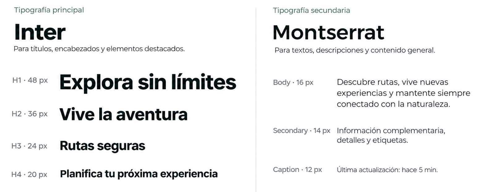
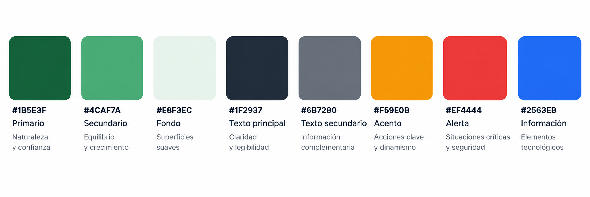

## Capítulo IV: Product Design

### 4.1. Style Guidelines

Las Style Guidelines de TourMate establecen los lineamientos visuales y de interacción que se utilizarán para mantener una identidad consistente en la Landing Page y la Web Application. Estos lineamientos definen el uso del logotipo, branding, tipografías, colores, espaciado y estilo de comunicación del producto.

La propuesta visual ha sido diseñada considerando los dos segmentos objetivo de TourMate: las agencias y operadores de turismo de aventura, que requieren gestionar y supervisar sus expediciones, y los turistas de aventura, que necesitan acceder de manera clara a información sobre sus rutas, recorridos y estado de la experiencia.

Debido al contexto en el que se utiliza TourMate, la identidad visual busca transmitir principalmente seguridad, orientación, aventura y tecnología, manteniendo una interfaz moderna y clara que facilite la identificación de rutas, checkpoints, estados de conectividad, monitoreo y alertas.

#### 4.1.1. General Style Guidelines

Los General Style Guidelines establecen los criterios generales que conforman la identidad visual de TourMate. Estos criterios permiten mantener coherencia entre los diferentes elementos y pantallas del producto, considerando el logotipo, branding, tipografía, colores, espaciado, tono y lenguaje.

##### 1. Logo

El logotipo de TourMate representa la relación entre aventura, naturaleza, ubicación y seguridad, conceptos directamente vinculados con la propuesta del producto. El símbolo integra elementos relacionados con la exploración y la geolocalización, haciendo referencia a los recorridos realizados por los turistas y al seguimiento de las expediciones.

La identidad del logotipo busca ser fácilmente reconocible tanto para los turistas como para las agencias de turismo. Asimismo, su diseño permite utilizarlo junto al nombre TourMate o como elemento gráfico independiente en diferentes componentes de la interfaz.

Para mantener una identidad visual consistente, el logotipo deberá conservar sus proporciones y colores originales, evitando deformaciones, rotaciones o modificaciones que puedan afectar su reconocimiento.

##### 2. Branding

El branding de TourMate busca transmitir una identidad segura, aventurera, tecnológica y cercana, relacionada directamente con las características del turismo de aventura y con la necesidad de brindar información confiable durante los recorridos.

La identidad de la marca se fundamenta en los siguientes conceptos:

- **Seguridad:** TourMate debe transmitir confianza al presentar información relacionada con la ubicación de los participantes, progreso de las expediciones, monitoreo y alertas.
- **Aventura:** la identidad visual mantiene una relación con la exploración, las rutas y los entornos naturales donde se desarrollan las actividades de turismo de aventura.
- **Orientación:** los elementos visuales deben facilitar la comprensión de rutas, ubicaciones y checkpoints durante el recorrido.
- **Tecnología:** la marca refleja el uso de soluciones digitales como geolocalización, navegación offline, wearables y checkpoints Bluetooth.
- **Cercanía:** la interfaz debe resultar comprensible tanto para los operadores turísticos como para los turistas, evitando una apariencia excesivamente técnica.

Estos principios permiten que TourMate mantenga una identidad coherente con su propósito: acompañar y facilitar la gestión de experiencias de turismo de aventura, integrando herramientas tecnológicas orientadas al seguimiento, navegación y prevención de riesgos.

##### 3. Typography

La identidad tipográfica de TourMate ha sido definida para mantener una interfaz moderna, clara y legible en los diferentes componentes del producto. Debido a que TourMate presenta información relacionada con rutas, expediciones, participantes, estados y alertas, se establece una jerarquía tipográfica que permita reconocer rápidamente la información más importante.

Se utilizarán dos tipografías principales: **Inter** y **Montserrat**.

- **Títulos principales (H1):** Inter Bold, 48 px.
- **Títulos de sección (H2):** Inter SemiBold, 36 px.
- **Subtítulos (H3):** Inter SemiBold, 24 px.
- **Encabezados menores (H4):** Inter SemiBold, 20 px.
- **Texto principal:** Montserrat Regular, 16 px.
- **Texto secundario:** Montserrat Regular, 14 px.
- **Texto auxiliar o captions:** Montserrat Regular, 12 px.

**Inter** se utilizará principalmente para títulos, encabezados y elementos destacados, mientras que **Montserrat** se empleará en párrafos, descripciones, etiquetas e información complementaria. Esta combinación permite establecer una jerarquía visual clara y mantener una lectura cómoda tanto para turistas como para operadores turísticos.

##### 4. Colors

La paleta de colores de **TourMate** ha sido definida considerando el contexto del turismo de aventura y las necesidades de interacción de sus usuarios. Los colores principales buscan transmitir naturaleza, confianza y seguridad, mientras que los colores complementarios permiten diferenciar acciones, alertas, información y estados dentro de la plataforma.

El uso consistente de esta paleta permitirá mantener una identidad visual reconocible tanto en la landing page como en la aplicación web, facilitando además la interpretación rápida de información relacionada con rutas, expediciones, monitoreo y situaciones de riesgo.

- **Primario – Verde oscuro (#1B5E3F):** representa naturaleza y confianza. Se utilizará como color principal de la identidad de TourMate en elementos destacados, navegación y componentes principales.

- **Secundario – Verde (#4CAF7A):** representa equilibrio y crecimiento. Complementará al color principal en elementos secundarios, estados positivos y componentes relacionados con el progreso de las expediciones.

- **Fondo – Verde claro (#E8F3EC):** se utilizará en fondos y superficies suaves para organizar visualmente el contenido sin generar una sobrecarga de color.

- **Texto principal – Gris oscuro (#1F2937):** destinado a títulos, párrafos y contenido de alta importancia, proporcionando claridad y legibilidad sobre fondos claros.

- **Texto secundario – Gris (#6B7280):** se utilizará para descripciones, etiquetas, fechas e información complementaria de menor jerarquía visual.

- **Acento – Naranja (#F59E0B):** destinado a acciones clave y elementos que requieran mayor atención visual, como botones principales, marcadores y llamadas a la acción.

- **Alerta – Rojo (#EF4444):** reservado para situaciones críticas, anomalías, advertencias y eventos que puedan representar un riesgo durante una expedición.

- **Información – Azul (#2563EB):** utilizado para mensajes informativos, estados de conectividad y elementos relacionados con información tecnológica o de seguimiento.

La aplicación de los colores seguirá un criterio funcional y consistente. Los tonos verdes mantendrán la identidad principal de **TourMate**, mientras que el naranja, rojo y azul permitirán diferenciar acciones y estados específicos. Asimismo, los tonos neutros favorecerán la legibilidad y la organización de la información dentro de la interfaz.

#### 5. Spacing

El sistema de espaciado de TourMate se define con el objetivo de mantener interfaces ordenadas, legibles y consistentes en los diferentes dispositivos. Se adopta una escala base de **8 px**, permitiendo establecer separaciones uniformes entre los elementos de la interfaz.

Los principales valores de espaciado son:

- **8 px:** separación mínima entre elementos relacionados, como iconos, etiquetas y textos.
- **16 px:** separación entre componentes dentro de una misma sección, como campos de formularios, botones o elementos de una tarjeta.
- **24 px:** espacio interno recomendado para cards, paneles y contenedores.
- **32 px:** separación entre grupos de contenido o secciones relacionadas.
- **48 px o más:** separación entre secciones principales de la landing page y vistas de mayor extensión.

Este sistema permite mantener una jerarquía visual clara y evita la concentración excesiva de información, especialmente en pantallas relacionadas con rutas, participantes, monitoreo y alertas. Asimismo, facilita que la interfaz pueda adaptarse de manera consistente a diferentes tamaños de pantalla.

#### 6. Tone

El tono de comunicación de TourMate será **claro, confiable, cercano y orientado a la seguridad**. Debido a que el sistema será utilizado tanto por turistas como por agencias y operadores turísticos, los mensajes deben ser comprensibles y permitir identificar rápidamente el estado de una actividad o la acción que debe realizarse.

TourMate busca transmitir:

- **Confianza:** especialmente al comunicar información relacionada con ubicación, monitoreo, estado de los participantes y seguridad.
- **Claridad:** los mensajes deben presentar únicamente la información necesaria y evitar ambigüedades.
- **Cercanía:** la comunicación dirigida al turista debe resultar amigable y sencilla durante toda la experiencia.
- **Seguridad:** las alertas y situaciones de riesgo deben comunicarse de manera visible, directa y precisa.
- **Orientación:** los mensajes deben ayudar al usuario a comprender qué está ocurriendo y qué acción puede realizar a continuación.

Se evitará un tono excesivamente técnico o alarmista. En situaciones críticas se priorizarán mensajes breves y directos que permitan al usuario comprender rápidamente la situación.

#### 7. Language

El lenguaje utilizado en TourMate será **directo, breve y orientado a la acción**, permitiendo que los usuarios comprendan rápidamente la información presentada durante la planificación y desarrollo de una experiencia de turismo de aventura.

Debido a que TourMate está dirigido tanto a turistas nacionales como extranjeros, la interfaz estará preparada para ofrecer contenido en **español e inglés**, manteniendo consistencia en términos, etiquetas, botones, alertas y mensajes del sistema.

Los mensajes seguirán los siguientes criterios:

- **Claridad:** utilizar palabras sencillas y evitar expresiones ambiguas o innecesariamente técnicas.
- **Brevedad:** presentar únicamente la información necesaria, especialmente durante recorridos y situaciones que requieran una respuesta rápida.
- **Orientación a la acción:** utilizar verbos que indiquen claramente al usuario qué puede hacer, como "Ver ruta", "Iniciar recorrido", "Ver ubicación" o "Solicitar ayuda".
- **Consistencia:** mantener los mismos términos para representar acciones, estados y elementos similares en toda la aplicación.
- **Comprensión de alertas:** los mensajes relacionados con seguridad deberán indicar claramente la situación detectada y, cuando corresponda, la acción recomendada.

Por ejemplo, se priorizarán expresiones como:

- `Iniciar recorrido` en lugar de `Proceder con el inicio de la actividad`.
- `Ver ubicación` en lugar de `Consultar información de geolocalización`.
- `Ruta sin conexión` en lugar de `Servicio de conectividad no disponible para la navegación`.
- `Alerta de seguridad` en lugar de mensajes técnicos difíciles de interpretar.

Este enfoque busca reducir la carga cognitiva del usuario y facilitar el acceso a información importante, especialmente en escenarios de baja conectividad o durante recorridos de aventura.

#### 4.1.2. Web Style Guidelines

