### 4.3. Landing Page UI Design

El diseño de la Landing Page de TourMate tiene como objetivo presentar de manera clara la propuesta de valor del producto, sus principales beneficios y funcionalidades, así como facilitar el acceso de turistas y agencias al registro y uso de la solución.

Para definir la interfaz se desarrolló inicialmente un wireframe que establece la estructura y distribución de los contenidos. Posteriormente, esta estructura será utilizada como base para el desarrollo del mock-up de alta fidelidad.

### 4.3.1. Landing Page Wireframe

El wireframe de la Landing Page de TourMate representa la estructura y distribución inicial de los principales elementos de la interfaz. Su propósito es definir la jerarquía de información, la ubicación de los componentes y el recorrido general del usuario antes de aplicar los elementos visuales definidos en las Style Guidelines.

La propuesta organiza la información de manera secuencial, permitiendo que el usuario conozca el propósito de TourMate, sus principales beneficios y funcionalidades, los tipos de usuarios a los que está dirigido y las opciones disponibles para conocer o utilizar el producto.

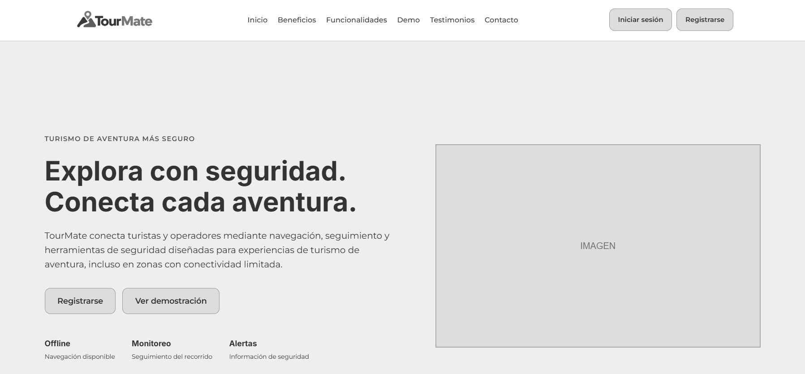

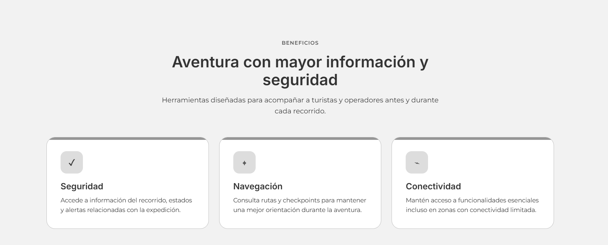

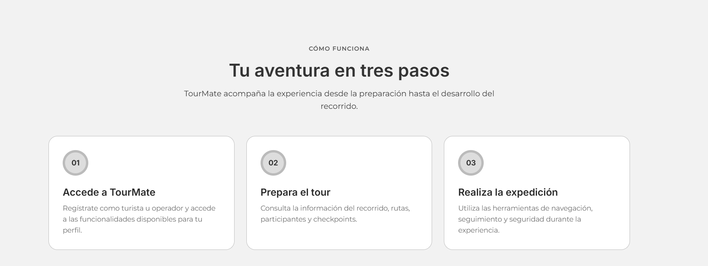

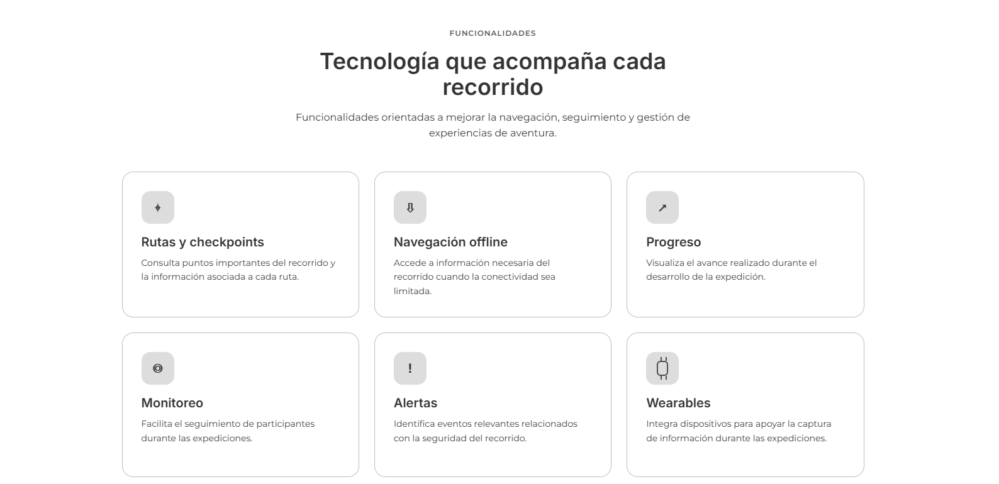

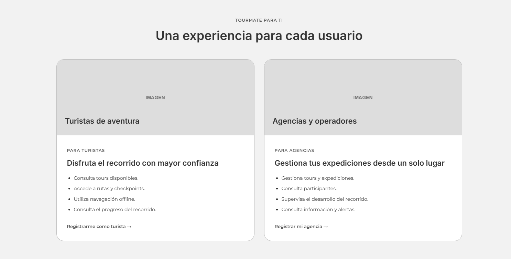

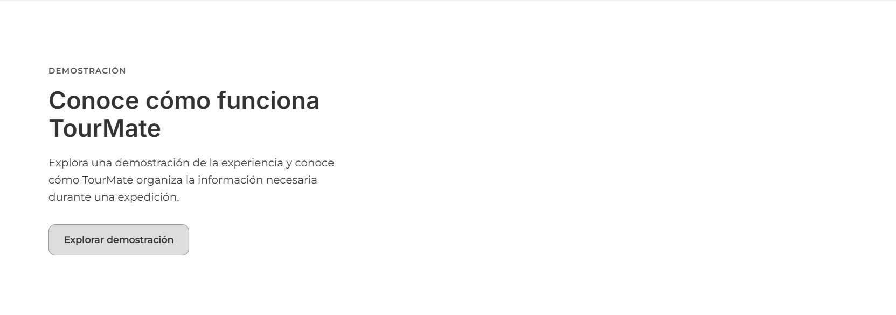

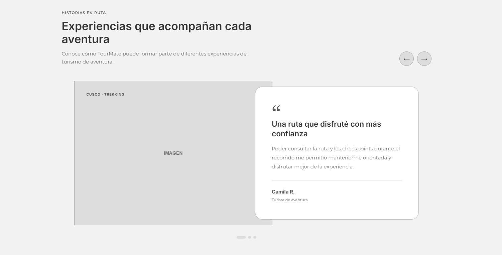

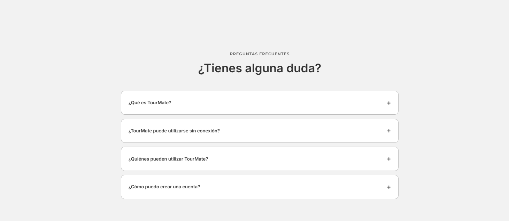

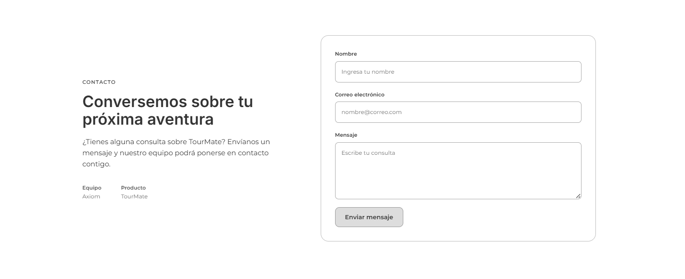

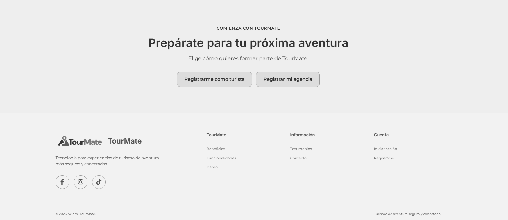

### 4.3.2. Landing Page Mock-up

El mock-up de la Landing Page de TourMate representa la propuesta visual final de la interfaz, desarrollada a partir de la estructura definida en el wireframe y de los lineamientos visuales establecidos para el producto. La propuesta incorpora la identidad visual de TourMate, fotografías relacionadas con el turismo de aventura, componentes de interfaz, llamadas a la acción y una organización visual orientada a turistas y operadores.

La Landing Page presenta los principales beneficios y funcionalidades de TourMate, el proceso general de uso, información diferenciada para turistas y agencias, una demostración del producto, historias representativas, preguntas frecuentes, un formulario de contacto y opciones de registro.

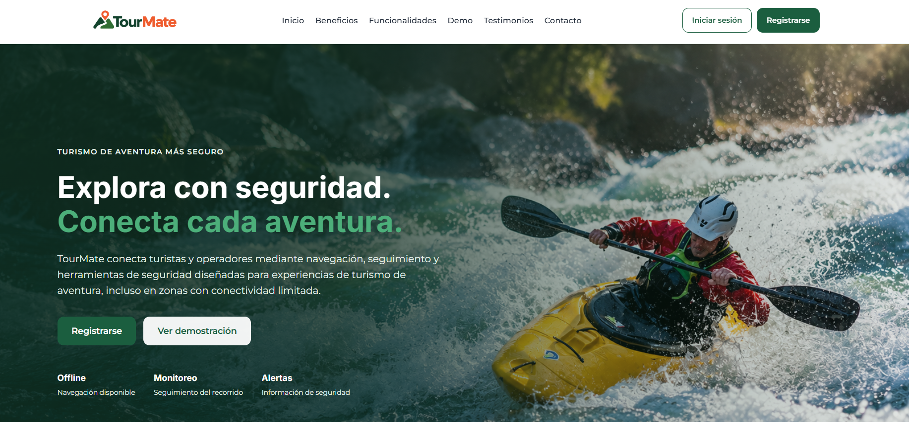

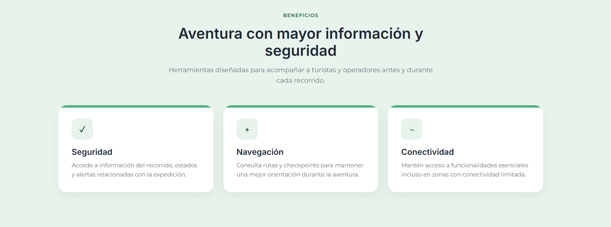

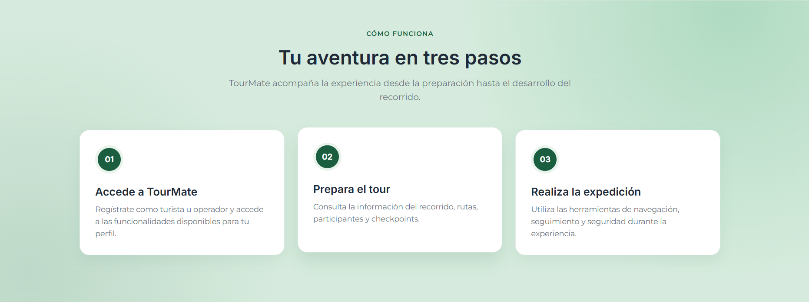

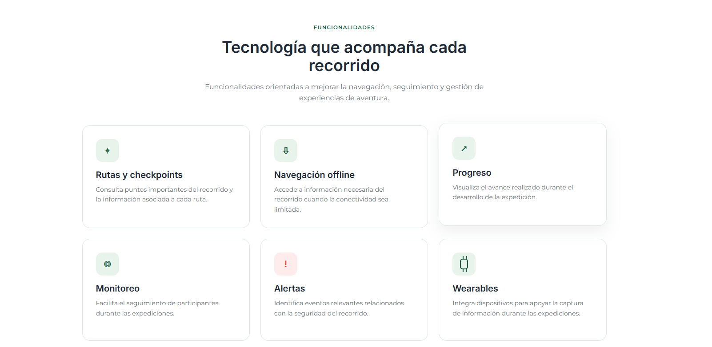

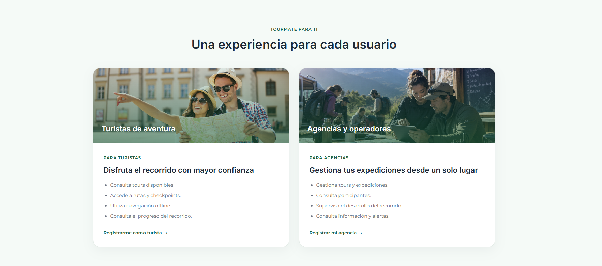

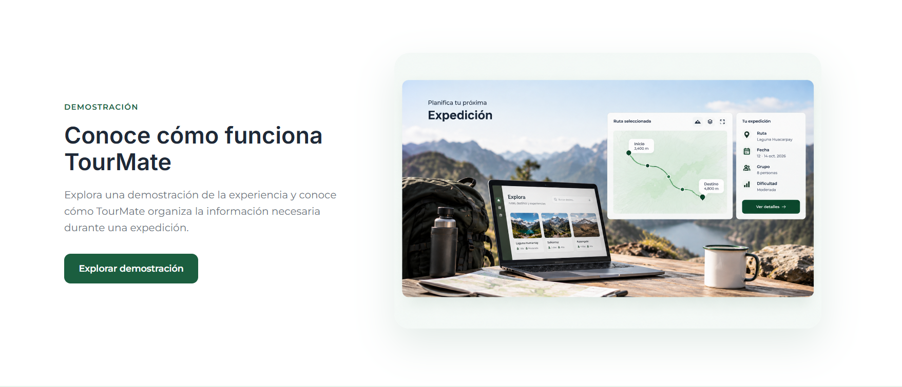

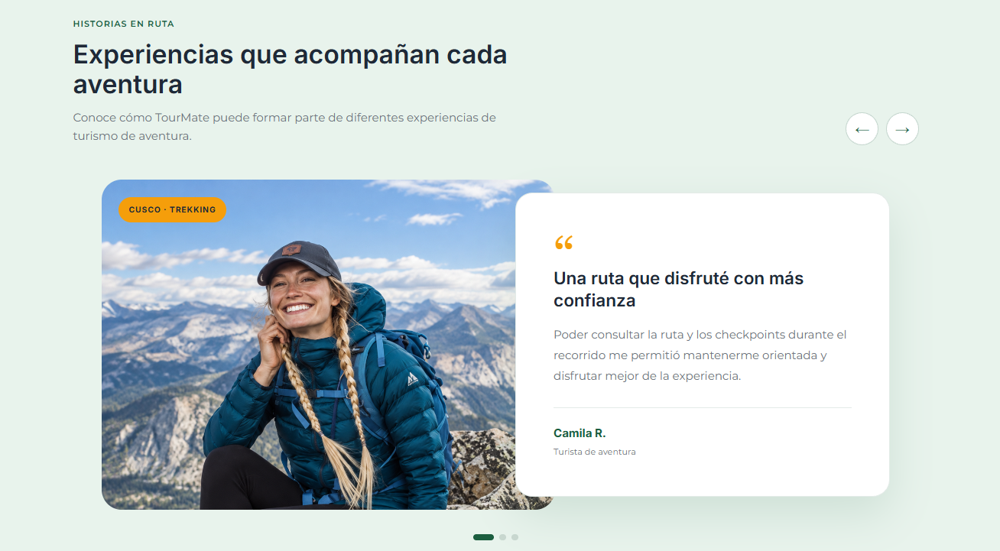

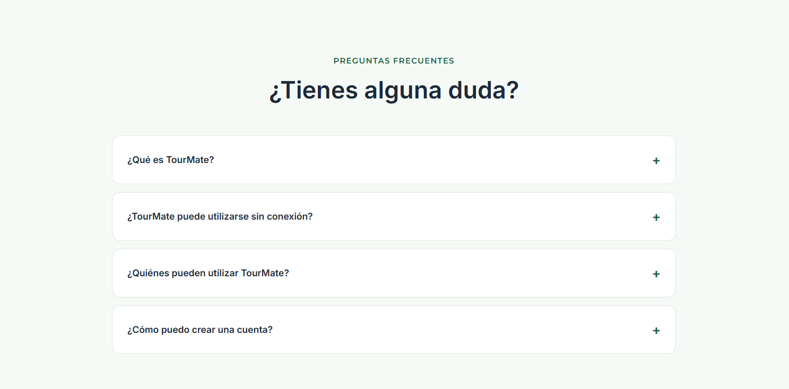

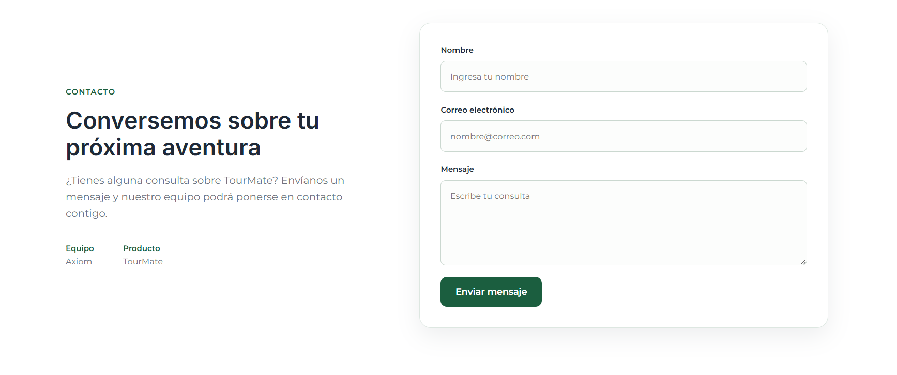

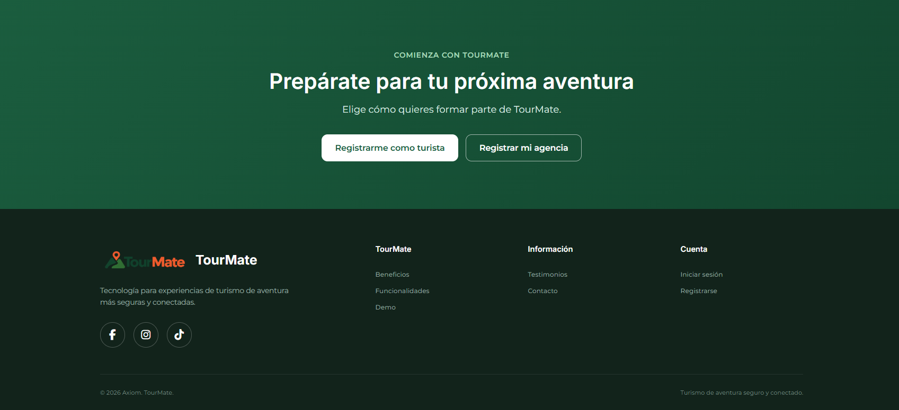

