### 4.3. Landing Page UI Design

El diseño de la Landing Page de TourMate tiene como objetivo presentar de manera clara la propuesta de valor del producto, sus principales beneficios y funcionalidades, así como facilitar el acceso de turistas y agencias al registro y uso de la solución.

Para definir la interfaz se desarrolló inicialmente un wireframe que establece la estructura y distribución de los contenidos. Posteriormente, esta estructura será utilizada como base para el desarrollo del mock-up de alta fidelidad.

#### 4.3.1. Landing Page Wireframe

El wireframe de la Landing Page de **TourMate** representa la estructura inicial de la interfaz y permite definir la distribución, jerarquía y organización de los principales elementos antes de aplicar los estilos visuales definitivos.

La página inicia con una sección principal que presenta la propuesta de valor de TourMate y proporciona accesos al registro y a la demostración del producto.

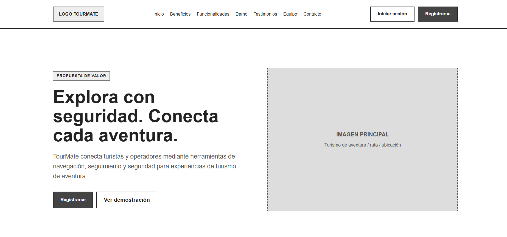

A continuación, se presentan los principales beneficios de TourMate relacionados con la seguridad, navegación y conectividad durante las experiencias de turismo de aventura.

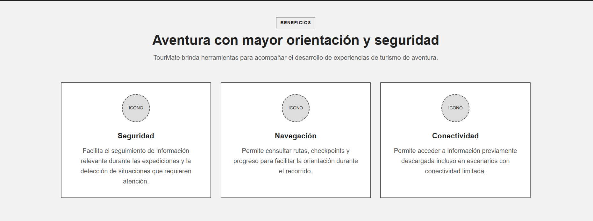

La sección **Cómo funciona** presenta de manera secuencial el proceso general de uso de TourMate, desde el acceso a la solución hasta la preparación del tour y el desarrollo de la expedición.

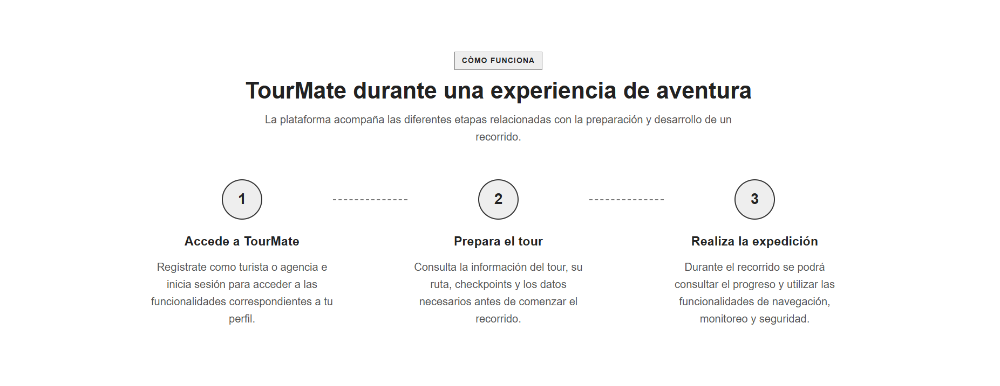

Posteriormente, se presentan las principales funcionalidades consideradas para TourMate, como rutas y checkpoints, navegación offline, progreso del recorrido, monitoreo, alertas y uso de dispositivos wearables.

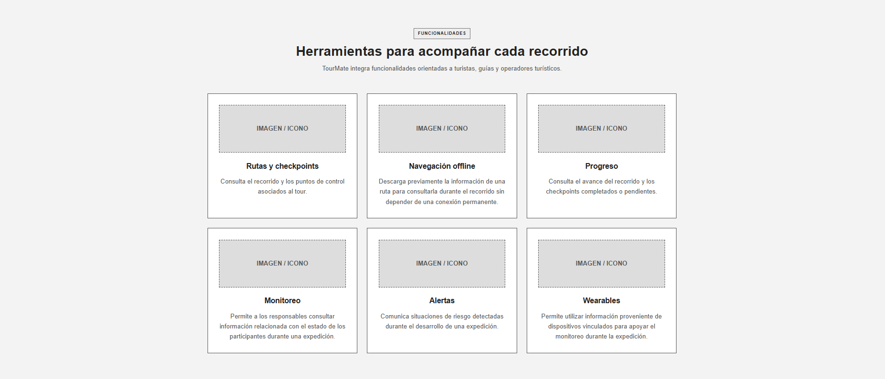

La Landing Page diferencia también la propuesta dirigida a sus dos principales segmentos: turistas de aventura y agencias u operadores turísticos.

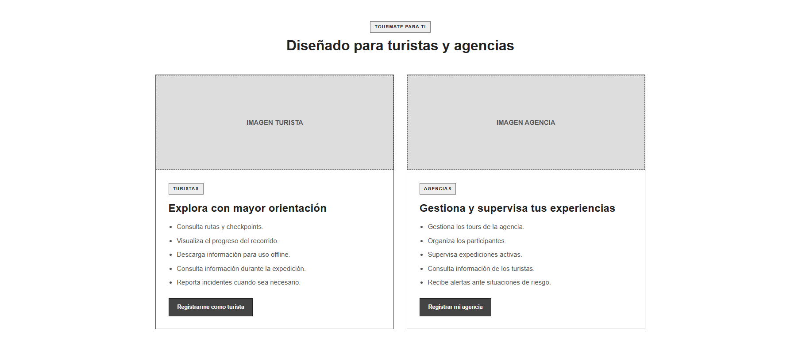

La sección de demostración proporciona un acceso para que el visitante pueda explorar una vista demostrativa del funcionamiento de TourMate antes de registrarse.

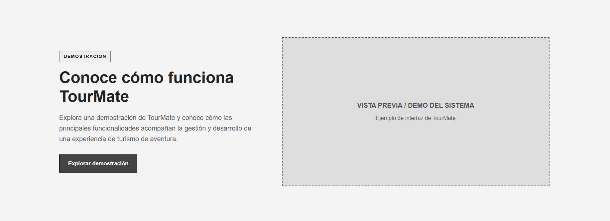

Asimismo, se considera una sección destinada a presentar testimonios y experiencias relacionadas con el uso de TourMate.

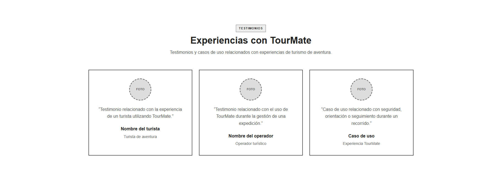

La Landing Page incluye una sección para presentar al equipo de **Axiom**, responsable del desarrollo de TourMate.

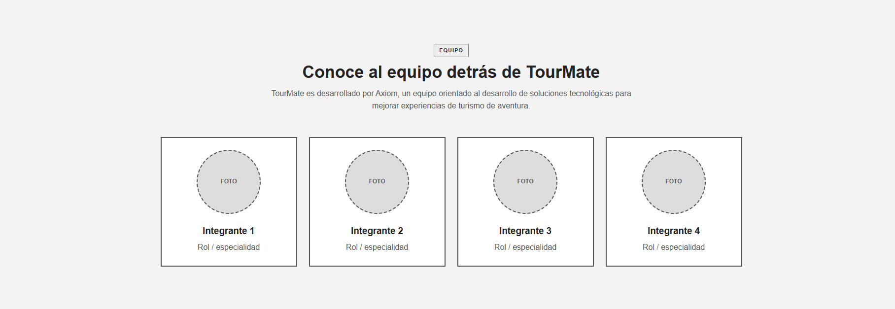

La sección de preguntas frecuentes permite organizar las principales dudas que pueden tener los visitantes antes de utilizar la solución.

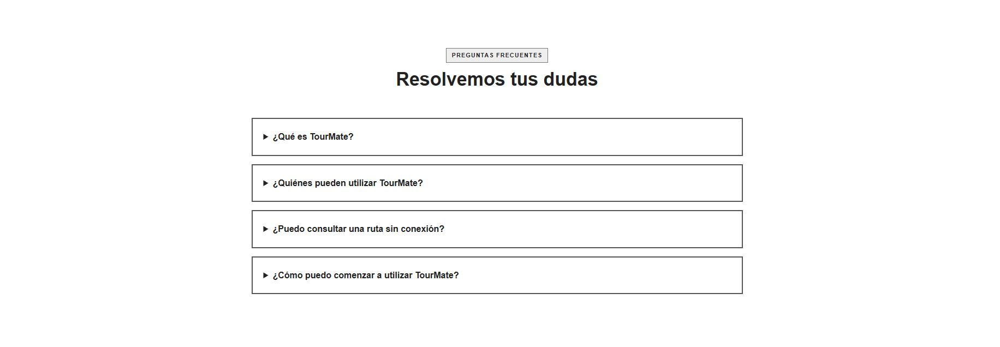

También se incorpora una sección de contacto mediante la cual los visitantes pueden comunicarse con el equipo de TourMate.

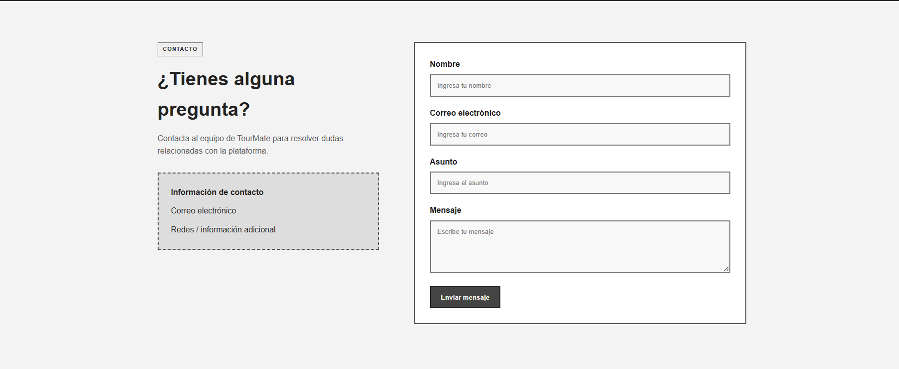

Finalmente, se presenta un llamado a la acción que permite iniciar el proceso de registro como turista o agencia, seguido del footer con accesos complementarios a las principales secciones de la Landing Page.

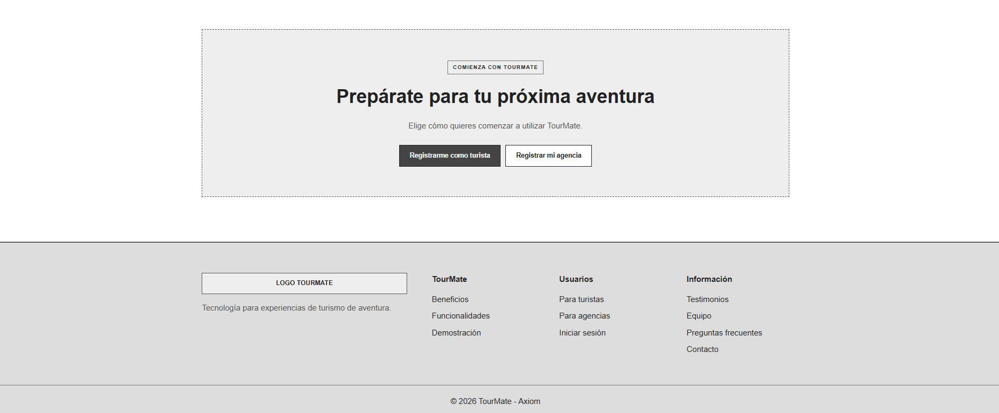

### 4.3.2 Landing Page Mock-up

